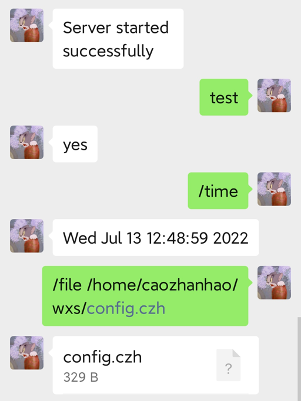

# 企业微信消息推送服务器
## 示例
### server

### weixin

## 功能
- 收到config.czh中定义的自动回复，会回复指定内容。
- 收到以`/`开头的会被识别为命令，使用命令必须以`/`开头
- 管理员可使用命令
## 安装
### 依赖
```
openssl 
curl
tinyxml2
libczh
```
### 使用 
```
mkdir build && cd build 
cmake .. && make
./wxserver -c ../config.czh 
```
### config.czh
- CorpID                  我的企业/企业信息/企业ID
- CorpSecret              应用管理/xxx/Secret
- Token和EncodingAESKey   应用管理/xxx/功能/设置API接收/
- 以上xxx代表应用名称，没有就创建一个
- tags为自动回复
- admin为管理员，使用true启用
## 扩展
### 添加命令
#### normal
`add_cmd(const std::string& tag, const Cmd_func& func)`
- 第一个参数是命令(不含`/`)，第二个参数是回调函数
- Cmd_func 即为 std::function<Cmd_ret(const std::string&)>
- Cmd_ret 即为 std::pair<const std::string, const std::string>，第一个string表发送类型(目前仅支持file,text)，第二个表内容。当发送类型为file时，内容为该文件路径
- 当服务器收到命令时，会向回调函数传递参数。`/`后的第一个空格分离命令和其参数,例`/file abc.txt`，命令为`file`,参数为`abc.txt`
#### rehabilitation
`add_rehabilitative_cmd(const std::string& tag, const Rehabilitative_cmd_func& func)`
- 第一个参数是命令(不含`/`)，第二个参数是回调函数
- Rehabilitative_cmd_func 即为 std::function<void(const std::string&)
- 必须有普通的cmd之后才可以添加rehabilitative_cmd
- rehabilitative_cmd会在普通的cmd发送Cmd_ret后运行
### 内置命令
#### time 
- 发送时间
#### file
- 发送文件
- 参数为文件路径
## 注意事项
- 使用`file`命令和添加的命令发送文件时， 5B<文件大小<20MB
