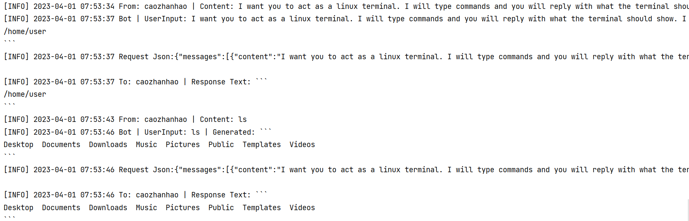
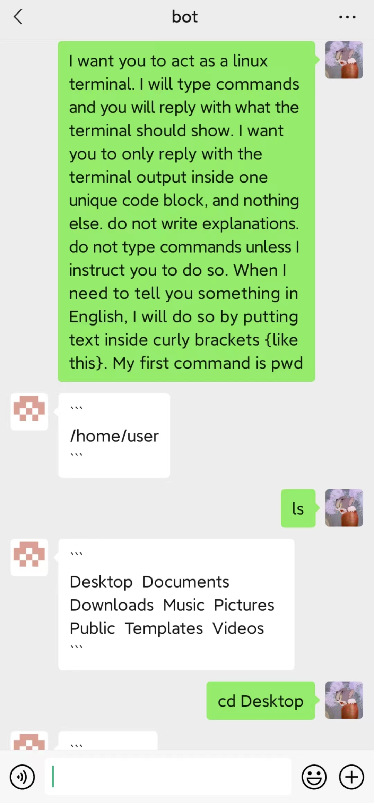

<h2 align="center">
wxserver
</h2> 

<p align="center">
<strong>C++ Header-only 企业微信消息推送服务器</strong>
</p>

下面是用wxserver接入的ChatGPT

### server



### weixin



### 使用方法

- 下面是一个消息回复示例

```c++
ws::Server server;
server.load_config("config.czh");
server.add_msg_handle(
    [&server](const ws::Request &req, ws::Response &res)
    {
      if (req.content == "license")
        res.set_file("LICENSE");
    });
server.run();
```

#### add_msg_handle

添加当接受的消息时的回调函数

```c++
[&server](const ws::Request &req, ws::Response &res){}
```

##### ws::Resquest

- `user_id` 消息发送者的id
- `content` 消息内容。

##### ws::Response

- `set_user(user_id)` 回复的用户，默认为消息发送者
- `set_text(str)`  回复字符串
- `set_file(path)` 回复文件
  `ws::Response`是在消息请求的响应包上带的消息，也可以异步发送消息, 如下

```c++
server.add_msg_handle(
    [&server](const ws::Request &req, ws::Response &res)
    {
      std::thread(
          [req, &server]()
          {
            //do something
            server.send_text(ret, req.user_id);
          }).detach();
    });
```

### config.czh

- 以下是必要的配置

| server               | info |
|----------------------|------|
| port                 | 运行端口 |
| logging_path | 日志文件 |

| weixin               | info                   |
|----------------------|------------------------|
| CorpID               | 位于我的企业/企业信息/企业ID       |
| CorpSecret           | 位于应用管理/xxx/Secret      |
| Token和EncodingAESKey | 位于应用管理/xxx/功能/设置API接收/ |

- 以下为示例中需要的配置，非必须
  [示例](examples/src/main.cpp)中接入了HuggingFace和OpenAI ChatGPT

| hugging_face | info                                          |
|--------------|-----------------------------------------------|
| model        | 需Conversational，如ingen51/DialoGPT-medium-GPT4 |
| token        | HuggingFace token                             |

| openai | info           |
|--------|----------------|
| model  | 如gpt-3.5-turbo |
| token  | OpenAI token   |

- 以上xxx代表应用名称，没有就创建一个

### 编译

- linux

```shell
g++ examples/src/main.cpp -I examples/src -I include -I thirdparty -I thirdparty/json/include -I thirdparty/libczh/include -lssl -lcrypto -lpthread -O2 -std=c++2a -o wxserver-linux
```

- windows

```shell
g++ examples/src/main.cpp -I examples/src -I "C:\Program Files\OpenSSL-Win64\include" -I include -I thirdparty -I thirdparty/json/include -I thirdparty/libczh/include -L "C:\Program Files\OpenSSL-Win64\lib" -lssl -lcrypto -l ws2_32 -l crypt32 -lpthread -O2 -std=c++2a -o wxserver-windows.exe
```

注意将OpenSSL的目录替换为你自己的。

### 注意事项

- 发送文件时，文件须小于20 MB

### 依赖

- openssl
- [nlohmann/json](https://github.com/nlohmann/json)
- [cpp-httplib](https://github.com/yhirose/cpp-httplib)
- [libczh](https://github.com/caozhanhao/libczh)
- 需C++ 20

### 贡献

- 欢迎PR