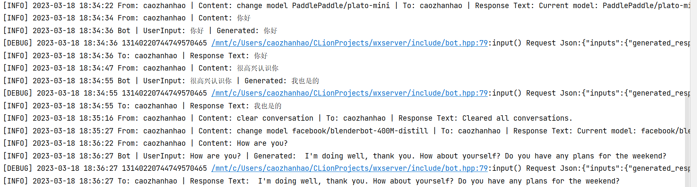
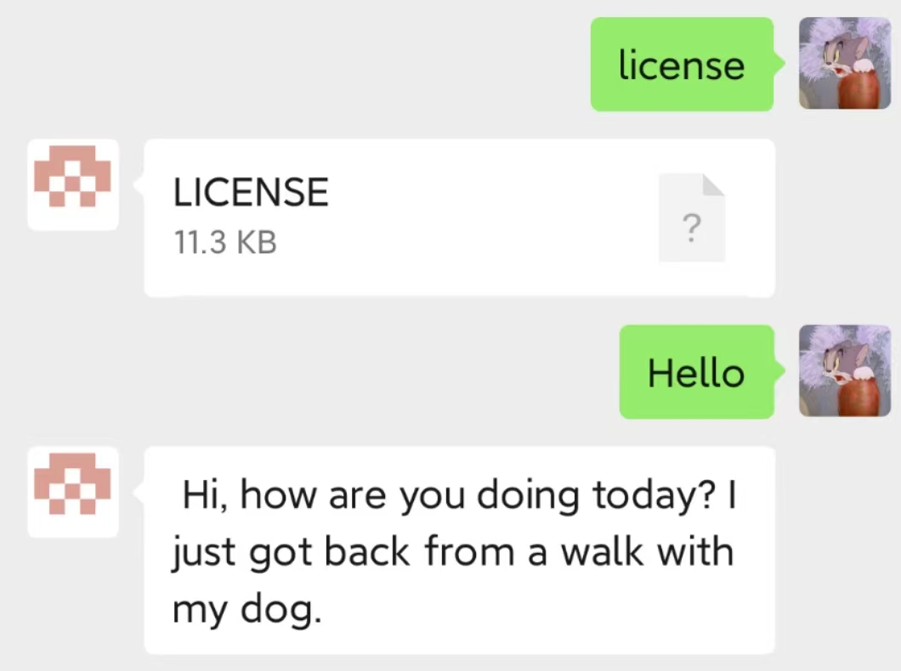

<h2 align="center">
wxserver
</h2> 

<p align="center">
<strong>企业微信消息推送服务器</strong>
</p>

### server



### weixin



### 使用方法

- 下面是一个简单的示例

```c++
server.init("config.czh",
  [](const ws::Request& req, ws::Response& res)
  {
    if(req.content == "Author")
      res.set_text("caozhanhao");
    else if(req.content == "License")
      res.set_file("LICENSE");
    else
      res.set_text("hello");
  });
```

### config.czh

| 配置                   | 相关信息                   |
|----------------------|------------------------|
| Port                 | 即wxserver运行端口          |
| CorpID               | 位于我的企业/企业信息/企业ID       |
| CorpSecret           | 位于应用管理/xxx/Secret      |
| Token和EncodingAESKey | 位于应用管理/xxx/功能/设置API接收/ |

- 以上xxx代表应用名称，没有就创建一个

### 编译

```
mkdir build && cd build 
cmake .. && make
./wxserver 
```

### 注意事项

- 发送文件时，文件须小于20 MB

### 依赖

- openssl
- [nlohmann/json](https://github.com/nlohmann/json)
- [cpp-httplib](https://github.com/yhirose/cpp-httplib)
- [libczh](https://github.com/caozhanhao/libczh)
