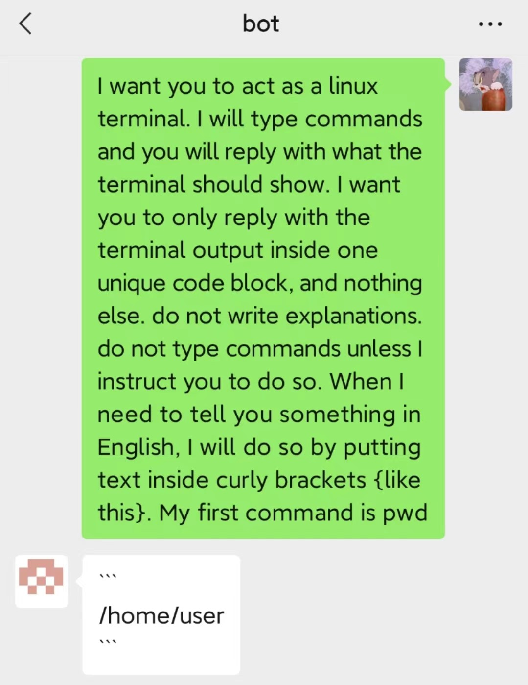
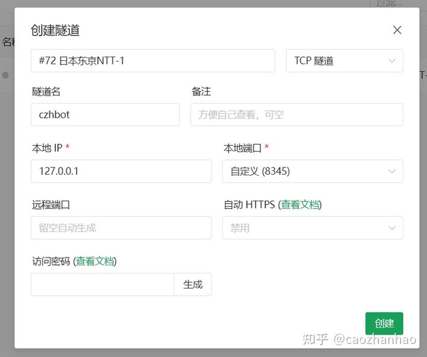
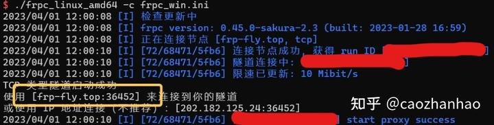
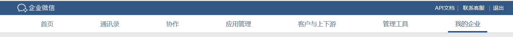
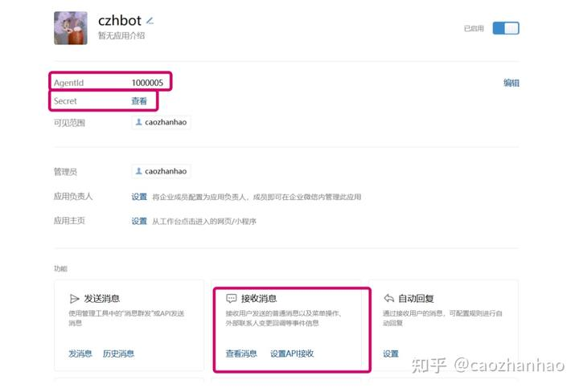
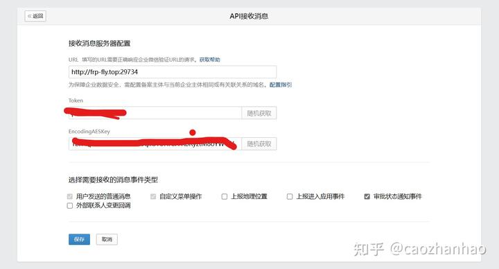
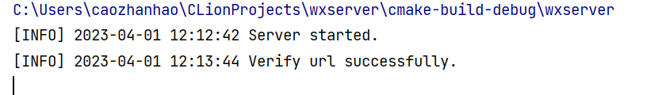
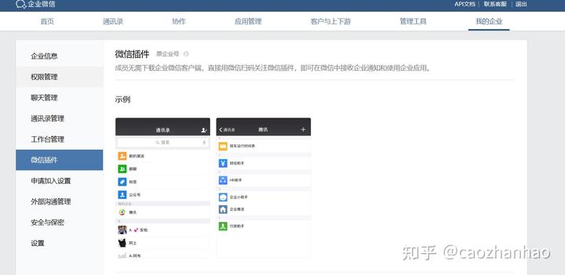

# 搭建微信机器人（可接入ChatGPT等）

- 转自[知乎 - caozhanhao](https://zhuanlan.zhihu.com/p/618651568)

本文使用企业微信API实现消息的接收和发送，不局限于接入ChatGPT。如果你因为网络问题不能用ChatGPT，也可以接入HuggingFace、做一个简单的自动回复甚至简易的监控等等。

接入ChatGPT效果：



项目地址:

* github: [caozhanhao/wxserver: C++企业微信消息推送服务器 (github.com)](https://github.com/caozhanhao/wxserver)
* gitee: [wxserver: C++企业微信消息推送服务器 (gitee.com)](https://gitee.com/cmvy2020/wxserver)

## 1\. 准备机器

这个项目是跨平台的，不过我只测试过Windows和Linux。手机上可以用termux的proot-distro等或者linux deploy；Windows上可以用WSL。这里如果你有一个公网服务器的话更好，但不是必须的。

* 安装wxserver

你可以从[github](https://github.com/caozhanhao/wxserver/releases) 或[gitee](https://gitee.com/cmvy2020/wxserver/releases)
下载编译好的二进制文件，

也可以从源码编译，需要C++20以及OpenSSL，详见Readme。

## 2\. 内网穿透

公网服务器请跳过。

这部分是为了接受微信的消息，如果不需要接收消息就不需要内网穿透，详见下面的扩展部分。

在[Sakura Frp](https://www.natfrp.com/) 注册账号，找到服务/创建隧道。

如果你想要更快的速度可以实名认证使用内地节点，这里我使用了海外节点。


选择TCP隧道，如下图填写隧道信息。这里本地端口可以换一个，但要与后面的步骤对应。



在[软件下载 | SakuraFrp
(natfrp.com)](https://www.natfrp.com/tunnel/download)
下载相应的版本，输入token([用户信息| SakuraFrp (natfrp.com)](https://www.natfrp.com/user/profile) ),选择刚才创建的隧道，启动。记录下面 黄框的地址。



## 2.企业微信

注册一个企业微信，打开电脑网页端的控制台



记录以下信息

* CorpID -> 位于我的企业/企业信息/企业ID

在应用管理里创建一个应用



记录

* CorpSecret -> Secret
* AgentId

找到接收消息/设置API接收

地址填刚才frp隧道的地址（或者公网服务器的地址），Token和EncodingAESKey随机获取。



记录

* Token
* EncodingAESKey

此时不要保存，因为企业微信此时会验证你的服务器。

填写第一步的config.czh

* `["server"]["port"]` 填写创建隧道时的"本地端口"
* `["weixin"]`填上面获得的信息

运行wxserver并点击保存



要在微信访问还要打开我的企业/微信插件



到这里微信端就已经配置好了，只需要接入OpenAI了。

## 3\. ChatGPT

将你的API Key填到`config.czh["openai"]`，model可以填"gpt-3.5-turbo"。如果需要http代理就填写proxy和proxy_port。

这时在微信端发送消息就可以看到开头的示例了。

注：发送clear conservation清除当前对话。

## 4\. 扩展

### 4.1 Hugging Face

如果不能用ChatGPT的话也可以接入[HuggingFace](https://huggingface.co/) ，填写`config.czh["hugging_face"]`
，然后将[main.cpp](https://github.com/caozhanhao/wxserver/blob/main/examples/src/main.cpp) 中改为

```c++
ws_example::HuggingFace bot(config["hugging_face"]["model"].get<std::string>(),
                            config["hugging_face"]["token"].get<std::string>());
```

### 4.2 自动回复

这里也可以设置自动回复，或者在`msg_handle`中拍照并上传

```c++
server.add_msg_handle(
     [&server](const ws::Request &req, ws::Response &res)
     {
       if (req.content == "Hello!")
       {
         res.set_content(ws::MsgType::text, "Hi!");
       }
       else if (req.content == "take a photo")
       {
         // do something to take a picture
         std::string your_pic_path = "Path";
         res.set_content(ws::MsgType::image, your_pic_path);
       }
     });
```

### 4.3 直接发送消息

以上都是被动接受消息时的回复，如果不需要消息接收的话，可以去掉add_msg_handle()和server.run(),直接发送消息，此时也不需要 内网穿透，如下。

```c++
ws::Server server;
server.load_config("config.czh");
server.send_message({ws::MsgType::text, "hello", "caozhanhao"});
```

### 4.4 更多

wxserver是一个header-only的C++库，你也通过它自己创建一个应用。

另外，在Android端还可以通过termux配合tasker, 实现短信转发到微信等功能，不过这里我没有深入研究。

## 5.相关链接

* wxserver github: [caozhanhao/wxserver: C++企业微信消息推送服务器 (github.com)](https://github.com/caozhanhao/wxserver)
* wxserver gitee: [wxserver: C++企业微信消息推送服务器 (gitee.com)](https://gitee.com/cmvy2020/wxserver)
* 企业微信API: [开发前必读 - 文档 - 企业微信开发者中心 (qq.com)](https://developer.work.weixin.qq.com/document/path/91201)
* Hugging Face: [Hugging Face – The AI community building the future.](https://huggingface.co/)
* OpenAI: [OpenAI](https://openai.com/)
* Sakura
  Frp: [Sakura Frp | 樱花内网穿透 — 免费内网穿透_免费端口映射_高速_高防节点_不限流量_Minecraft我的世界_微信开发调试_群辉NAS_无需公网_免备案 (natfrp.com)](https://www.natfrp.com/)